# LibraryManagementProject
LIBRARY MANAGEMENT SYSTEM

OBJECTIVE:
A library management software where admin can add students and books , can issue and return books and also view the statistics of issued & returned books.

USERS OF THE SYSTEM:

•	Admin

FUNCTIONAL REQUIREMENTS:

Admin can

•	Can Login

•	Add Students

•	Add Books

•	Issue Books

•	Return Books

•	View Statistics

•	Can Logout

TOOLS USED:

Project have been made using Netbeans and MYSQL has been used as database.

Front End: Java Swing

Back End: MYSQL

	

How Project Works  

On running the file,a login window will get open.

	

Write name and password: It must be admin for name and admin for password.

On logging in,a home page gets open.

Click on New Student Button.

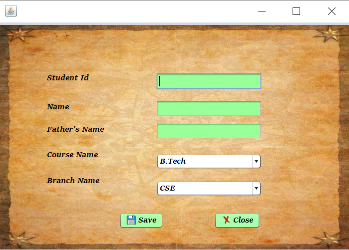

Fill the required details.

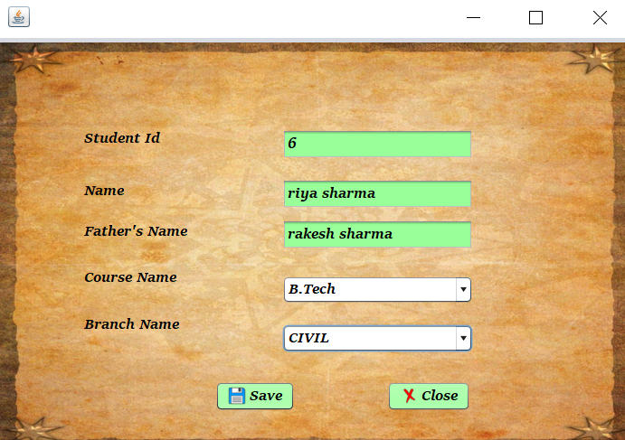

	

Now,click on New Book Button and fill the required details.
	

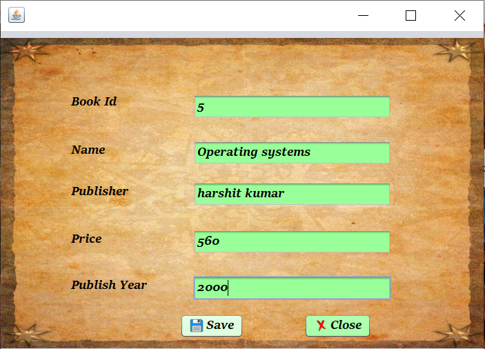

To issue book,click on Issue Book Button.
 Also , fill the details.    

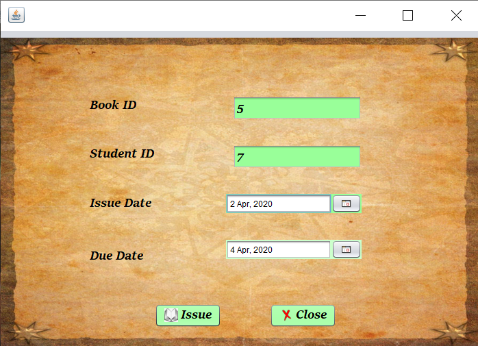

To return book,click on Return Book Button.

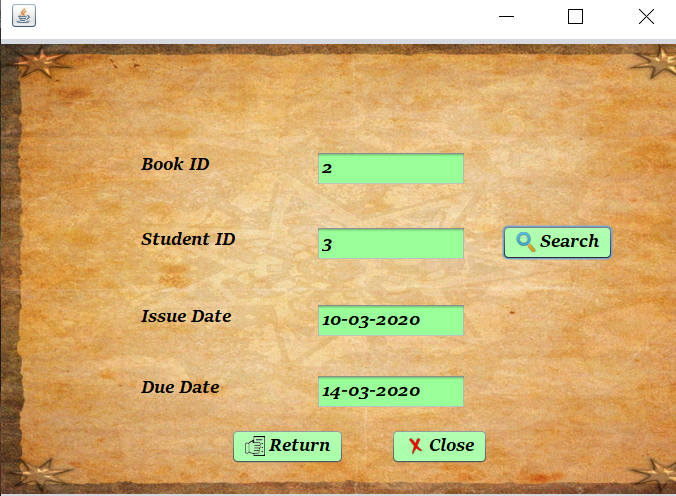
	

Also,an instance when you enter wrong details.

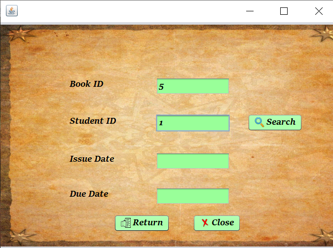

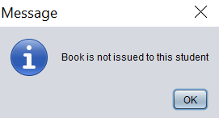

Click on Statistics Button to view statistics of issued and returned book.

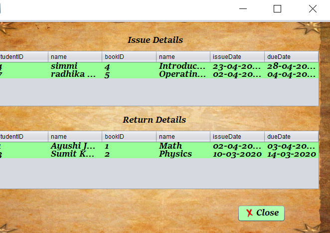

To logout,click on Logout button.

 
CLASS DIAGRAM

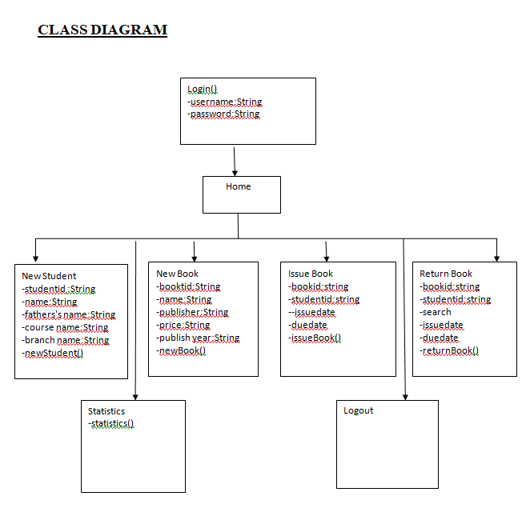

ACTIVITY DIAGRAM

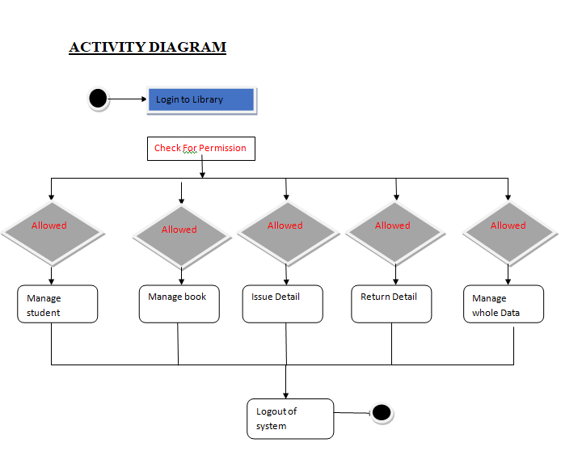

	

DATAFLOW DIAGRAM

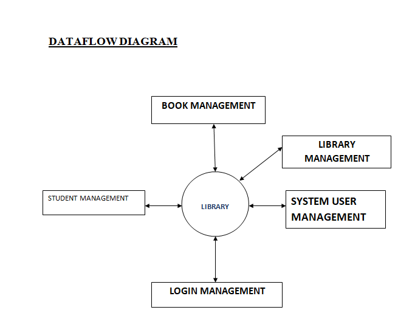

COLLABORATION DIAGRAM

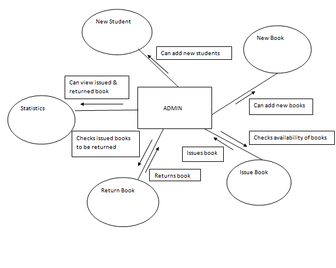

ER DIAGRAM

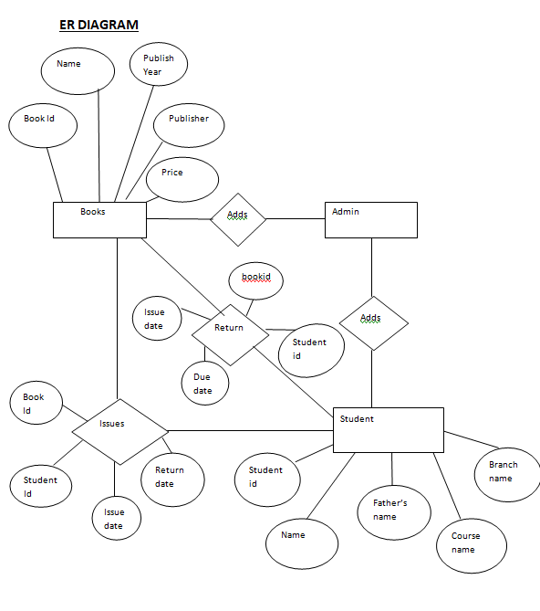
